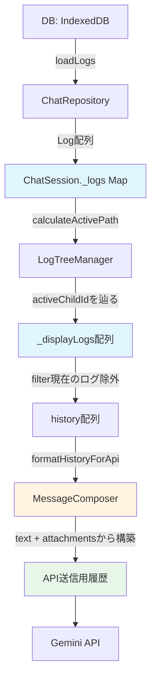

# データフローとデータ構造

このドキュメントでは、チャットシステムにおけるデータの流れと、送信履歴の構築プロセス、およびメタデータ保存の影響について説明します。

## 目次

- [データ構造の概要](#データ構造の概要)
- [データフロー全体](#データフロー全体)
- [送信履歴の構築プロセス](#送信履歴の構築プロセス)
- [メタデータ保存とその影響](#メタデータ保存とその影響)
- [重要な結論](#重要な結論)

## データ構造の概要

### Log オブジェクト

チャットメッセージは `Log` 型として保存され、以下の主要フィールドを持ちます：

```typescript
interface Log {
  id: string;                    // 一意なID
  speaker: 'user' | 'model';     // 発言者
  text: string;                  // メッセージテキスト
  timestamp: string;             // タイムスタンプ
  parentId: string | null;       // 親メッセージID（ツリー構造）
  activeChildId: string | null;  // アクティブな子メッセージID（分岐管理）
  metadata?: any;                // 送信メタデータ（記録用）
  attachments?: AttachedFile[];  // 添付ファイル
  tokenUsage?: {...};            // トークン使用量
  thoughtProcess?: string;       // 思考プロセス
}
```

### 重要な分離

- **`text`**: メッセージの実際の内容（必須、送信に使用）
- **`attachments`**: 添付ファイル情報（送信に使用）
- **`metadata`**: APIリクエストの記録（記録専用、送信には不使用）

## データフロー全体



## 送信履歴の構築プロセス

### 1. セッション読み込み

**ファイル**: [`chat.svelte.ts`](file:///c:/Users/ag89d/Projects/simple-gemini-ui/src/lib/state/chat.svelte.ts#L391-L410)

```typescript
async load(id?: string) {
    this._logs.clear();
    if (id) {
        this._sessionId = id;
        // DBから全ログを取得（text, attachments, metadata すべて含む）
        const logs = await this.repo.loadLogs(id);
        logs.forEach(log => this._logs.set(log.id, log));
    }
    this._refreshDisplayLogs();
}
```

**取得内容**: 
- 完全な `Log` オブジェクト
- `metadata` に `requestPayload` が含まれる（`saveMinimalMetadata=true` なら `contents` は最新3件のみ）

### 2. 表示ログの計算

**ファイル**: [`chat.svelte.ts`](file:///c:/Users/ag89d/Projects/simple-gemini-ui/src/lib/state/chat.svelte.ts#L142-L144)

```typescript
private _refreshDisplayLogs() {
    this._displayLogs = this.treeManager.calculateActivePath(this._logs);
}
```

**ファイル**: [`log-tree-manager.ts`](file:///c:/Users/ag89d/Projects/simple-gemini-ui/src/lib/logic/log-tree-manager.ts#L8-L37)

```typescript
calculateActivePath(logs: Map<string, LogWithSessionId>): LogWithSessionId[] {
    // 1. parentId = null のログをルートとして取得
    let root = Array.from(logs.values()).find(l => !l.parentId);
    
    // 2. activeChildId を辿ってパスを構築
    const path: LogWithSessionId[] = [root];
    let current = root;
    
    while (current.activeChildId) {
        const child = logs.get(current.activeChildId);
        if (child) {
            path.push(child);
            current = child;
        } else {
            break;
        }
    }
    return path;
}
```

**結果**: 完全な `Log` オブジェクトの配列（`metadata` 含むが使用しない）

### 3. 送信時の履歴フィルタリング

**ファイル**: [`chat.svelte.ts`](file:///c:/Users/ag89d/Projects/simple-gemini-ui/src/lib/state/chat.svelte.ts#L501-L502)

```typescript
// 現在送信中のユーザーログを除外した履歴
const history = this._displayLogs.filter(l => l.id !== userLog.id);
await this._runAiGeneration(userLog, history);
```

### 4. API履歴フォーマット

**ファイル**: [`chat.svelte.ts`](file:///c:/Users/ag89d/Projects/simple-gemini-ui/src/lib/state/chat.svelte.ts#L183-L188)

```typescript
const apiHistory = this.composer.formatHistoryForApi(historyLogs);
const apiContent = this.composer.createApiPayload(
    triggerUserLog.text,
    settings,
    triggerUserLog.attachments
);
```

**ファイル**: [`message-composer.ts`](file:///c:/Users/ag89d/Projects/simple-gemini-ui/src/lib/logic/message-composer.ts#L125-L156)

```typescript
formatHistoryForApi(logs: LogWithSessionId[]): Array<{ role: string, parts: any[] }> {
    return logs.map(l => {
        // log.text からテキストパートを作成
        const parts: any[] = [{ text: l.text.replace(DICE_SEPARATOR, "") }];
        
        // log.attachments から添付ファイルパートを追加
        if (l.attachments && l.attachments.length > 0) {
            l.attachments.forEach(att => {
                if (att.storageType === 'inline' && att.data) {
                    parts.push({
                        inlineData: {
                            mimeType: att.mimeType,
                            data: att.data
                        }
                    });
                } else if (att.storageType === 'fire_storage' && att.fileUri) {
                    parts.push({
                        fileData: {
                            mimeType: att.mimeType,
                            fileUri: att.fileUri
                        }
                    });
                }
            });
        }
        
        return {
            role: l.speaker === 'user' ? 'user' : 'model',
            parts
        };
    });
}
```

**重要**: `metadata` は一切参照していない

## メタデータ保存とその影響

### メタデータの保存処理

**ファイル**: [`ai-orchestrator.ts`](file:///c:/Users/ag89d/Projects/simple-gemini-ui/src/lib/services/ai-orchestrator.ts#L87-L96)

```typescript
let metaToSave = requestPayload;
if (settings.assist.saveMinimalMetadata) {
    // contents を最新3件のみに削減
    metaToSave = { ...requestPayload, contents: requestPayload.contents.slice(-3) };
}

return {
    responseText: responseText.trim(),
    thoughtProcess: thoughtProcess.trim() || undefined,
    metadata: JSON.parse(JSON.stringify(result)),
    requestPayload: metaToSave,  // ← 削減されたメタデータ
    tokenUsage: result.usageMetadata,
    // ...
};
```

### requestPayload の内容

**ファイル**: [`gemini.ts`](file:///c:/Users/ag89d/Projects/simple-gemini-ui/src/lib/services/gemini.ts#L159-L163)

```typescript
const requestPayload = {
    model: this.modelName,
    contents: JSON.parse(JSON.stringify(contents)), // 全履歴 + 添付ファイル
    config: config  // 生成設定
};
```

### ユーザーログへのメタデータ保存

**ファイル**: [`chat.svelte.ts`](file:///c:/Users/ag89d/Projects/simple-gemini-ui/src/lib/state/chat.svelte.ts#L207-L211)

```typescript
// ユーザーログにメタデータを保存
triggerUserLog.metadata = {
    ...triggerUserLog.metadata,
    ...result.requestPayload  // ← saveMinimalMetadata=true なら contents は3件のみ
};
await this._updateLogEntity(triggerUserLog);
```

### 保存されるデータ構造

```typescript
// DBに保存される Log オブジェクト
{
  id: "uuid",
  speaker: "user",
  text: "ユーザーの入力テキスト",         // ← 完全に保存
  attachments: [...],                      // ← 完全に保存
  metadata: {                              // ← 記録用
    model: "gemini-2.5-pro",
    contents: [...],  // saveMinimalMetadata=true なら最新3件のみ
    config: {...}
  },
  // ...
}
```

## 重要な結論

### ✅ `saveMinimalMetadata` は送信データに影響しない

**理由:**

1. **DBから読み込まれたログオブジェクトには `text` と `attachments` が完全に保存されている**
   - `saveMinimalMetadata` で削減されるのは `metadata.contents` のみ
   - `log.text` と `log.attachments` は削減されない

2. **`formatHistoryForApi` は各ログの `text` と `attachments` から履歴を再構築する**
   - `metadata.contents` は参照していない
   - 毎回ログオブジェクトから新規に `parts` 配列を生成

3. **`metadata.contents` は完全に記録用**
   - デバッグや分析のためだけに保存
   - 送信処理では一切使用されていない

### データの使用用途

| フィールド | 保存場所 | 送信に使用 | 記録用 | 削減対象 |
|-----------|---------|----------|--------|---------|
| `text` | `log.text` | ✅ Yes | ✅ Yes | ❌ No |
| `attachments` | `log.attachments` | ✅ Yes | ✅ Yes | ❌ No |
| `metadata.contents` | `log.metadata.requestPayload.contents` | ❌ No | ✅ Yes | ✅ Yes (saveMinimalMetadata) |
| `metadata.model` | `log.metadata.requestPayload.model` | ❌ No | ✅ Yes | ❌ No |
| `metadata.config` | `log.metadata.requestPayload.config` | ❌ No | ✅ Yes | ❌ No |

### メタデータ削減の効果

- **ストレージ削減**: 長い会話履歴でも最新3件のみ保存するため、DBサイズが抑えられる
- **送信影響**: なし（送信は常に `log.text` と `log.attachments` から再構築される）
- **用途**: デバッグやトラブルシューティング時の参照用

## 関連ファイル

- [chat.svelte.ts](file:///c:/Users/ag89d/Projects/simple-gemini-ui/src/lib/state/chat.svelte.ts) - チャットセッション管理
- [message-composer.ts](file:///c:/Users/ag89d/Projects/simple-gemini-ui/src/lib/logic/message-composer.ts) - API履歴フォーマット
- [log-tree-manager.ts](file:///c:/Users/ag89d/Projects/simple-gemini-ui/src/lib/logic/log-tree-manager.ts) - ログツリー管理
- [repository.ts](file:///c:/Users/ag89d/Projects/simple-gemini-ui/src/lib/db/repository.ts) - DB操作
- [ai-orchestrator.ts](file:///c:/Users/ag89d/Projects/simple-gemini-ui/src/lib/services/ai-orchestrator.ts) - AI生成オーケストレーション
- [types.ts](file:///c:/Users/ag89d/Projects/simple-gemini-ui/src/lib/types.ts) - 型定義
