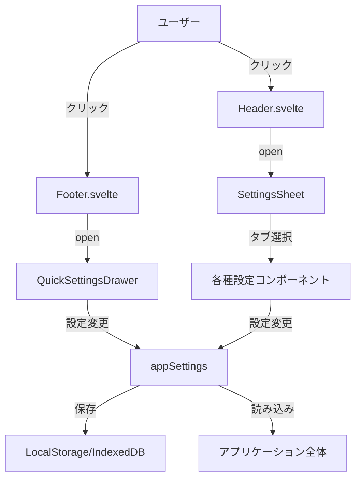

# 機能一覧

このドキュメントでは、simple-gemini-uiアプリケーションのクイックメニューと設定コンポーネントの機能をまとめています。

## 目次
1. [クイックメニュー](#クイックメニュー)
2. [設定パネル](#設定パネル)
3. [コンポーネント構成](#コンポーネント構成)

---

## クイックメニュー

`QuickSettingsDrawer.svelte` - フッターの左側にあるグリッドアイコンから開くことができる、よく使う機能への素早いアクセスを提供するDrawerコンポーネント。

### 機能一覧

#### 1. システムプロンプト (System Prompt)
- **アイコン**: Cpu
- **機能**: システムプロンプトの有効/無効を切り替え
- **状態表示**: 有効時はフォアグラウンドカラー、無効時は半透明

#### 2. ダミーユーザー (Dummy User)
- **アイコン**: User
- **機能**: ダミーユーザープロンプトの有効/無効を切り替え
- **状態表示**: 有効時はフォアグラウンドカラー、無効時は半透明

#### 3. ダミーモデル (Dummy Model)
- **アイコン**: Bot
- **機能**: ダミーモデルプロンプトの有効/無効を切り替え
- **状態表示**: 有効時はフォアグラウンドカラー、無効時は半透明

#### 4. ダイスロール (Dice Roll)
- **アイコン**: Dices
- **機能**: 全てのダイス設定を一括で有効/無効を切り替え
- **状態表示**: いずれかのダイスが有効な場合にON表示
- **動作**: 現在の状態を反転させる（全てON → 全てOFF、または全てOFF → 全てON）

#### 5. ランダム選択肢 (Random Choice)
- **アイコン**: ListChecks
- **機能**: 全てのカスタム選択肢設定を一括で有効/無効を切り替え
- **状態表示**: いずれかのカスタム選択肢が有効な場合にON表示
- **動作**: 現在の状態を反転させる

#### 6. 一番上に移動 (Scroll Top)
- **アイコン**: ChevronUp
- **機能**: チャットビューポートをトップまでスクロール
- **状態表示**: 常に半透明（アクションボタン）

#### 7. 一番下に移動 (Scroll Bottom)
- **アイコン**: ChevronDown
- **機能**: チャットビューポートを最下部までスクロール
- **状態表示**: 常に半透明（アクションボタン）

#### 8. コピー (Copy)
- **アイコン**: Copy
- **機能**: 現在の入力フィールドの内容を専用クリップボードにコピー
- **状態表示**: 常に半透明（アクションボタン）
- **保存先**: `appSettings.value.quickClipboard`

#### 9. 貼り付け (Paste)
- **アイコン**: Clipboard
- **機能**: 専用クリップボードから入力フィールドに内容を追加
- **状態表示**: クリップボードに内容がある場合は通常表示、ない場合は半透明
- **動作**: 既存の入力内容に追加される形で貼り付け

### 技術仕様
- **履歴管理**: ブラウザの履歴APIを使用してバックボタンでの閉じる動作をサポート
- **状態管理**: Svelte 5の`$derived`を使用した反応的な状態管理
- **自動保存**: 設定変更時に`appSettings.save()`で自動保存

---

## 設定パネル

`SettingsSheet.svelte` - ヘッダー右側の設定アイコンから開くことができる、詳細な設定を行うためのシートコンポーネント。

### タブ構成

#### 1. API・モデル (`ApiSettings.svelte`)

##### APIキー管理
- **機能**: 複数のAPIキーを管理
- **追加**: `Plus`アイコンで新しいキーを追加
- **削除**: アラートダイアログで確認後に削除
- **選択**: ラジオボタンで現在使用するキーを選択
- **名前編集**: 各キーに識別用の名前を付与可能

##### モデル設定
- **モデル選択**: Geminiモデルを選択
- **モデルリスト更新**: `RefreshCw`アイコンでGemini APIからモデルリストを取得
- **フィルタリング**: Geminiで始まるモデルのみを表示

##### リトライ設定
- **指数バックオフ**: 有効/無効の切り替え
- **最大リトライ回数**: 数値入力（有効時のみ）
- **初期待機時間**: ミリ秒単位で設定（有効時のみ）

#### 2. 生成 (`GenerationSettings.svelte`)

##### プロンプト設定（3種類）

各プロンプトタイプ（システム、ダミーユーザー、ダミーモデル）で以下の機能を提供:

- **有効化スイッチ**: プロンプトの有効/無効を切り替え
- **プリセット管理**:
  - プリセット選択: ドロップダウンで選択
  - 追加: 新規プリセットを作成
  - 複製: 既存プリセットをコピー
  - 削除: アラートダイアログで確認後に削除
- **プリセット編集**:
  - タイトル編集: プリセット名を変更
  - テキスト編集: プロンプト本文を編集（Textareaで複数行対応）

##### 生成パラメータ
- **Temperature**: 数値入力で設定
- **Top P**: 数値入力で設定
- **Top K**: 数値入力で設定
- **Max Output Tokens**: 数値入力で設定

#### 3. UI (`InterfaceSettings.svelte`)

##### 基本表示設定
- **トークン数を表示**: スイッチで有効/無効
- **Enterキーで送信**: スイッチで有効/無効（無効時はShift+Enterで送信）

##### フォント設定
- **カスタマイズ有効化**: スイッチで有効/無効
- **文字サイズ**: 数値入力（ピクセル単位）
- **フォント選択**: セレクトボックスで選択
  - 利用可能フォント: `FONT_FAMILY_OPTIONS`定数で定義
  - プレビュー表示: 各オプションが選択フォントで表示

#### 4. 簡易機能 (`DiceSettings.svelte`)

##### アシスト機能
- **URL自動補正**: Markdownリンクを自動補正

##### 簡易ダイスロール設定
- **一括有効化**: 全ダイス設定を一括でON/OFF
- **ダイス設定**:
  - 指示テキスト: AI へのダイス使用指示
  - ダイス数: 振る個数
  - ダイス面数: サイコロの面数（d6, d100など）
  
##### ダイス送信詳細機能（アコーディオンで展開）
- **独立送信**: ダイス結果を別パートとして送信
- **マーカー設定**: 開始/終了マーカーのカスタマイズ

##### カスタム選択肢設定
- **一括有効化**: 全カスタム選択肢を一括でON/OFF
- **選択肢設定**:
  - 指示テキスト: AI への選択肢使用指示  
  - 選択肢: 改行区切りのテキストで入力

##### カスタム選択肢送信詳細機能（アコーディオンで展開）
- **独立送信**: 選択結果を別パートとして送信
- **マーカー設定**: 開始/終了マーカーのカスタマイズ

#### 5. 使用量 (`UsageSettings.svelte`)

##### 使用量通知
- **トークン使用量アラート**: スイッチで有効/無効
- **しきい値設定**: トークン数で指定

##### トークン使用履歴
- **表示通貨設定**: USD/JPY選択
- **為替レート表示**: 現在のレート表示
- **期間フィルタ**: 今日/1週間/1ヶ月/全期間
- **モデルフィルタ**: 全モデル/個別モデル

##### 使用統計表示
- **概算費用**: USD表示（状況に応じて2〜4桁表示）
- **トークン内訳**:
  - 入力トークン数
  - 出力トークン数
  - キャッシュトークン数（キャッシュ率も表示）
  - 合計トークン数
- **金額内訳**: 入力/出力の金額内訳

##### データ管理
- **履歴削除**: アラートダイアログで確認後に全履歴を削除

#### 6. アカウント (`AccountSettings.svelte`)

##### Dropbox バックアップ
- **ログイン/ログアウト**: Dropbox認証の管理
- **自動バックアップ**: スイッチで有効/無効
- **手動バックアップ**: ボタンで即座にバックアップ実行
- **最終バックアップ日時表示**: 最後に実行された日時を表示

##### バックアップ復元（ダイアログ）
- **日付選択**: 左側パネルで日付フォルダを選択
- **ファイルグループ表示**: 
  - 自動バックアップグループ
  - 手動バックアップグループ（60秒以内の近接バックアップを自動グルーピング）
- **選択機能**:
  - グループチェックボックス: グループ内全ファイルを選択/解除
  - 個別チェックボックス: 個別ファイルを選択
  - 全選択: 全ファイルを一括選択/解除
- **復元実行**: 選択したファイルから復元
  - 個別セッションを復元
  - 重複の場合は上書き確認

##### Danger Zone (`DangerZone.svelte`)
- **全データ削除**: アラートダイアログで確認後に全データを削除
  - チャットセッション
  - 設定
  - ローカルストレージ

---

## コンポーネント構成

### アプリケーションコンポーネント (`src/lib/components/app/`)

```
app/
├── Header.svelte              # ヘッダー（タイトル、トークン数表示、設定ボタン）
├── Footer.svelte              # フッター（入力エリア、クイックメニューボタン、送信ボタン）
├── QuickSettingsDrawer.svelte # クイックメニュー
├── SettingsSheet.svelte       # 設定パネル（メインコンテナ）
├── ChatMessage.svelte         # チャットメッセージ表示
├── ChatHistorySheet.svelte    # チャット履歴
└── MarkdownRenderer.svelte    # マークダウンレンダリング
```

### 設定コンポーネント (`src/lib/components/settings/`)

```
settings/
├── ApiSettings.svelte         # API・モデル設定
├── GenerationSettings.svelte  # 生成設定（プロンプト、パラメータ）
├── InterfaceSettings.svelte   # UI設定
├── DiceSettings.svelte        # 簡易機能設定（ダイス、カスタム選択肢）
├── UsageSettings.svelte       # 使用量設定・統計
├── AccountSettings.svelte     # アカウント設定（Dropboxバックアップ）
└── DangerZone.svelte          # データ削除（危険な操作）
```

### データフロー



### 設定データ構造

設定は `AppSettings` 型で管理され、以下の主要な構造を持ちます:

```typescript
{
  apiKeys: ApiKey[],              // APIキーリスト
  activeApiKeyId: string,         // 現在使用中のAPIキーID
  selectedModel: string,          // 選択中のモデル
  
  systemPrompt: TemplatePromptConfig,      // システムプロンプト設定
  dummyUserPrompt: TemplatePromptConfig,   // ダミーユーザー設定
  dummyModelPrompt: TemplatePromptConfig,  // ダミーモデル設定
  
  generationConfig: {             // 生成パラメータ
    temperature: number,
    topP: number,
    topK: number,
    maxOutputTokens: number
  },
  
  ui: {                           // UI設定
    showTokenCount: boolean,
    enterToSend: boolean,
    useCustomFontSize: boolean,
    chatFontSize: number,
    fontFamily: string
  },
  
  diceRolls: DiceRoll[],         // ダイス設定配列
  customChoiceRolls: CustomChoiceRoll[],  // カスタム選択肢配列
  quickClipboard: string,        // 専用クリップボード
  
  apiErrorHandling: {            // リトライ設定
    exponentialBackoff: boolean,
    maxRetries: number,
    initialWaitTime: number
  },
  
  tokenUsageAlert: {             // 使用量アラート
    enabled: boolean,
    threshold: number
  },
  
  backup: {                      // バックアップ設定
    enabled: boolean,
    lastBackupAt: string
  }
}
```

---

## 関連ファイル

- [データフロー詳細](./data-flow.md)
- [セットアップガイド](./setup.md)
- タイプ定義: `src/lib/types.ts`
- 定数定義: `src/lib/constants.ts`
